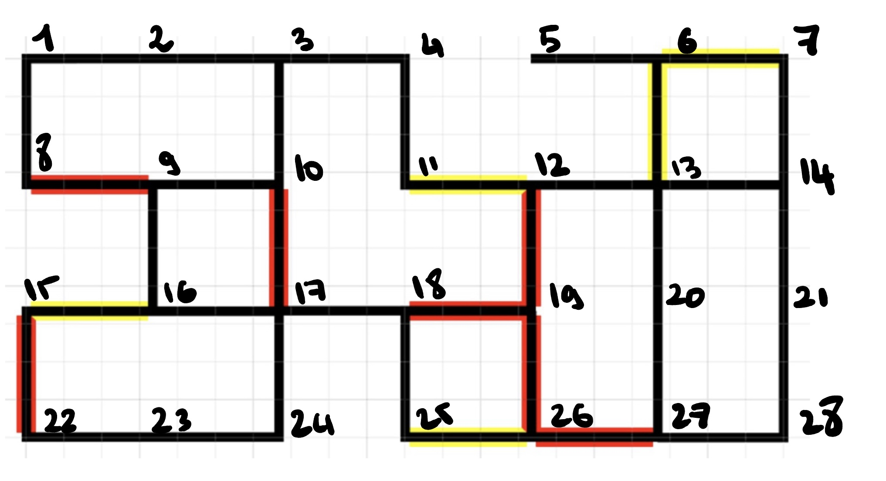

# POLYNATOR

A high-performance line-following robot with seamless hardware-software integration, showcasing expertly crafted microcontroller programming for optimal functionality.

## Table of Contents

- [Description](#description)
- [Getting Started](#getting-started)
- [Hardware Components](#hardware-components)
- [Pictures](#pictures)
- [Award](#award)

## Description
This project features two distinct modes accessible through buttons:

1. **Identifying the Coin Mode:**
   - Locates the coin and determines the robot's orientation.

2. **Travelling the Path:**
   - The robot travels from Point A to B, specified by buttons on the breadboard.
   - Utilizes Djikstra's algorithm to calculate the shortest path.
   - Detects poles using a distance sensor; if a pole is detected, the robot emits a sound and recalculates the shortest path.
   
During the path traversal, the robot continually detects obstacles (poles) and dynamically adjusts its route.
The map is coded in the library using an adjacency matrix format, with the top-left point (Row: 1, Column: 1) 
denoted as 1, and the mapping progressing row by row. Each colour in the segments represents a weight, red is 5, yellow is 2 and black is 1. 
For a more visual representation, please consult the image below.

## Getting Started
- Before getting started, ensure you compile the library in the projet/lib folder by running the command `make` 
  in the terminal.
- Navigate back to the projet/app folder and run the command `make install` to install the code on the robot. Make sure 
  the robot is connected to the computer through a USB cable. 

## Hardware Components

- **Line Follower Sensor (Cytron Maker Line):**
  - Connected to ports PORTA (0:4)

- **LCD:**
  - Display connected to entire PORTC

- **Distance Sensor (Sharp GP2D120):**
  - Used to find obstacles, connected to port PA5

- **Piezo:**
  - Generates sound, connected to pins PD6 and PD7

- **LEDs:**
  - Connected to ports A6 and A7

- **Wheels:**
  - Left wheels connected to B4 and B5, right wheels connected to B1 and B3.

### Buttons

- **Selection Button:**
  - Connected to the second pin of PORTB (PB2)

- **Validation Button:**
  - Connected to the third pin of PORTD (PD3)

- **Interrupt Button:**
  - Connected to the second pin of PORTD (PD2)

## Pictures

*The POLYNATOR*

*The POLYNATOR*

## Award

This project received the *Philip and Lily Malouf Award* for outstanding computer/software engineering project, recognizing its innovative design and outstanding performance.
